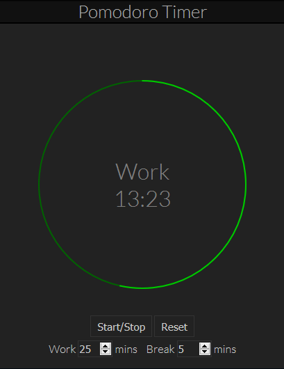

# PomodoroTimer

A Pomodoro Timer created with JavaScript, for the [Front End Development Certification from FreeCodeCamp](https://www.freecodecamp.com/bburns).

To use the timer, click [here](http://bburns.github.io/PomodoroTimer/).

